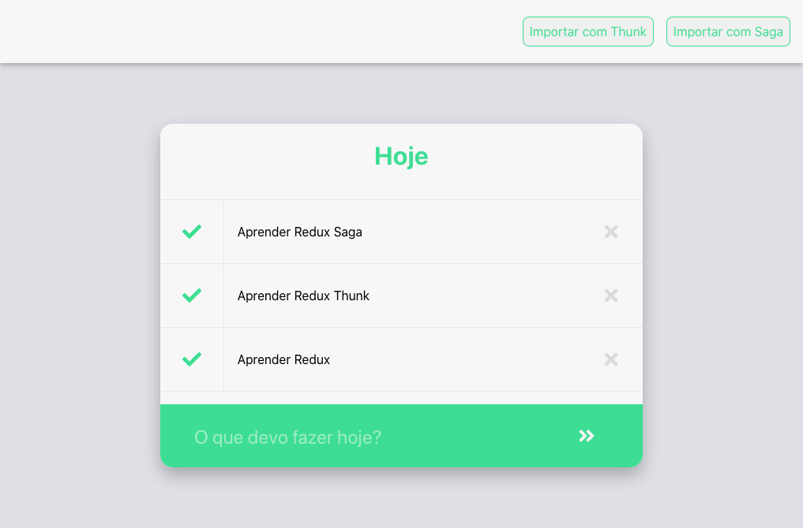

# Redux ToDo
Simple project created to learn about the usage of [redux](https://redux.js.org/), [redux-thunk](https://github.com/reduxjs/redux-thunk) and [redux-saga](https://redux-saga.js.org/)

## Available Scripts

In the project directory, you can run:

### `yarn start`

Runs the app in the development mode. 
Open [http://localhost:3000](http://localhost:3000) to view it in the browser.

### `yarn build`

Builds the app for production to the `build` folder. 
It correctly bundles React in production mode and optimizes the build for the best performance.

This project was bootstrapped with [Create React App](https://github.com/facebook/create-react-app).